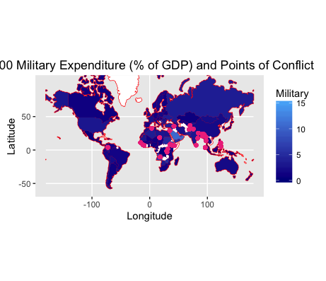
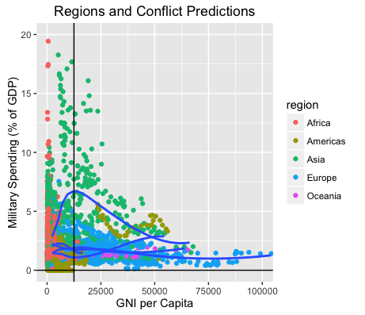

MATH 216 Data Science Final Project (Fall 2016)
================

-   Name: Connor McCormick
-   Project title: The Effects of GNI on Military Spending
-   Write-up on RPubs: <http://rpubs.com/connormccormick/final>
-   Abstract: In this analysis, I look the effects of gross national income (GNI) per capita on military spending as a percentage of gross domestic product (GDP). Using the World Development Indicators from 1960 to present, I use GNI per capita in current dollars to look at conflict and military spending as a percentage of GDP. I have additional data for conflicts and country code information.

**INTRODUCTION**
================

  The world is more connected now than ever in the past with the rise of globalization, the internet and the information. There are an increasinly large number ways that countries interact with each other. The United States set up and encouraged participation in international institutions during the post-WWII era, which ended an era of isolation in exchange for a capitalist driven era of open markets and open borders. According to Slaughter (2009), we live in a networked world and the new measure of power is connectedness. The most powerful nation is at the center the network, like a spider in the center of a web, and the United States currently has the biggest edge. Since countries are so interconnected through globalization, rarely do conflicts only affect the country involved. Conflicts drag in allies, now more so than ever, and no country outside the United States has the military capacity to act unilaterally.
  The Syrian Civil War is an example of an internal conflict that has affected the globe, as millions of refugees pour into neighboring nations in the Middle East, further destabilizing an unstable region. The effects are even being felt in the Western World as nations in Europe begin to accept refugees as asylum seekers. As more nations get involved with the conflict, like Russia, Iran and Turkey, the fighting continues and spreads to greater areas. Syria is an outlier on this front, since there have been fewer and fewer conflicts in the recent decades.
  Military spending has been found to impact short term economic, which would effect GNI per capita. Dunne (2012) find a statistically significant relationship between short term economic growth and military spending. This is due to resources that could be used for social programs, like public health clinics or low income housing, is spent on million dollar missiles and machine guns. North Korea is an example of this effect, where a large portion of the countries GDP is diverting to its nuclear weapons program and other military sources. As the North Korean people are forced to use bark for flour, Kim Jong-Un is spending millions of dollars on the military. Military spending as a percentage of GDP would logically have a convex curve, as countries would spend a decreasing amount of their GDP on military at a decreasing rate. Likely, these countries would have a minimum threshold they would like to stay above to repel any unexpected attacked from a rogue nation or terrorist organization.
  My theory is that as countries increase their GNI per capita, they will decrease their spending on military. This theory consists of reasoning on two fronts since it explore correlation, rather than causality. First, as countries increase their GNI per capita, they become wealthier. As a fact of this increase in wealth, military spending as a percentage of GDP will likely also fall because they will be spending around the same dollar amount on the military, while GDP increases. Second, the Democratic Peace Theory states that democracies do not go to war with each other. This theory, along with the fact that the most developed nations are democracies, supports that increased GNI per capita leads to lower military spending.

Military Spending and Conflict Map
----------------------------------

  This map shows conflicts that occured in 2000 as well as the military expenditure as a percentage of GDP. The countries in areas that have the most conflict tend to have higher military spending. Since this is just a one year snapshot of military spending, it may not give the full picture. For example, Eritrea, in 2000, spent over 30% of its GDP on the military, which influenced the gradient too much. This dimished the nuances between other nations, so I capped the military spending at 15% of GDP. The nations in white have no information about them.

**Regional Predictions**
------------------------

### Regional Model

|                 |  Estimate|  Std. Error|  t value|  Pr(&gt;|t|)|
|-----------------|---------:|-----------:|--------:|------------:|
| (Intercept)     |   120.155|       9.429|   12.744|            0|
| GNIPCAP10x      |     0.447|       0.069|    6.493|            0|
| I(GNIPCAP10x^2) |    -0.065|       0.011|   -5.904|            0|
| year            |    -0.059|       0.005|  -12.502|            0|
| regionAmericas  |    -0.970|       0.111|   -8.749|            0|
| regionAsia      |     1.189|       0.100|   11.856|            0|
| regionEurope    |    -0.861|       0.120|   -7.159|            0|
| regionOceania   |    -1.074|       0.226|   -4.741|            0|

  Using a model to predict military spending with GNI per Capita per $10000, region, country and year, I look at the regional average to the country level data. Since the predictor is an aggregate of average GNI per capita, it has a very short span for the most part.

  For the model, I use GNI per capita at a changing rate of $10,000 to truly show the effects of large changes in GNI per capita. I run two models, one with country, region and year controls and one with only region and year controls. There are no significant changes and the one shown just has controls for region and year. My model predicts that military spending will decrease at a decreasing rate, which is statistically significant. Also, controls for region reveal interesting information on each continent as the Americas, Europe and Oceania have a negative effect on military spending, around a 1% decrease, while Asia experiences a 1% increase.

**CONFLICT PREDICTIONS**
------------------------

|                |  Estimate|  Std. Error|  t value|  Pr(&gt;|t|)|
|----------------|---------:|-----------:|--------:|------------:|
| (Intercept)    |    15.057|       1.386|   10.865|        0.000|
| GNIPCAP10x     |    -0.024|       0.004|   -5.369|        0.000|
| Military       |     0.007|       0.002|    3.171|        0.002|
| year           |    -0.007|       0.001|  -10.760|        0.000|
| regionAmericas |    -0.078|       0.016|   -4.854|        0.000|
| regionAsia     |     0.102|       0.014|    7.249|        0.000|
| regionEurope   |    -0.102|       0.017|   -6.076|        0.000|
| regionOceania  |    -0.073|       0.033|   -2.236|        0.025|

  One last model to look at how GNI per capita and military spending affect conflict. This is a linear probability model, so the coefficiencts can be interpreted as percent change. So, if a country increases their military spending by ten percentage points, then there will be an 8% increase in the chance of a conflict. Also, if a country is in Asia, they have are 10% more likely to have a conflict than the base value, Africa. This model also shows that the number of conflicts have decreased over the period of this data set, consisting mainly of values from 1988-2015. This model also shows that for every $10,000 increase in GNI per capita, a country is 2.3 percentage points less likely to experience a conflict.

**CONCLUSION**
==============

  My work shows strong correlation between GNI per capita (per $10000) and the square of that, proving my theory to be right to some extend. The model shows that military spending decreases at a decreasing rate as GNI per capita increases. None of the models can predict causation because the variables are confounding, meaning that a change X will likely cause a change in Y. All of the variables are very statistically significant, which shows that military spending is impacted by GNI per capita, region and year.
  I also run into the issue of reverse causality, which I hint at in the introduction. In the Dunne paper, the empirical results show that conflict and military spending actually cause a short term economic growth, which would impact GNI per capita. So, military spending could actually cause changes in GNI per capita, instead of the other way around. Since this paper is just looking at correlations rather than causation, it is not an issue, but further study would have to run more careful regressions to get at a true causal effect.

References:

Dunne, John Paul. "Military spending, growth, development and conflict." Defence and Peace Economics 23.6 (2012): 549-557.

Slaughter, Anne-Marie. "America's Edge: Power in the Network Century." Academic OneFile. Foreign Affairs, Jan.-Feb. 2009. Web. 12 Dec. 2016.